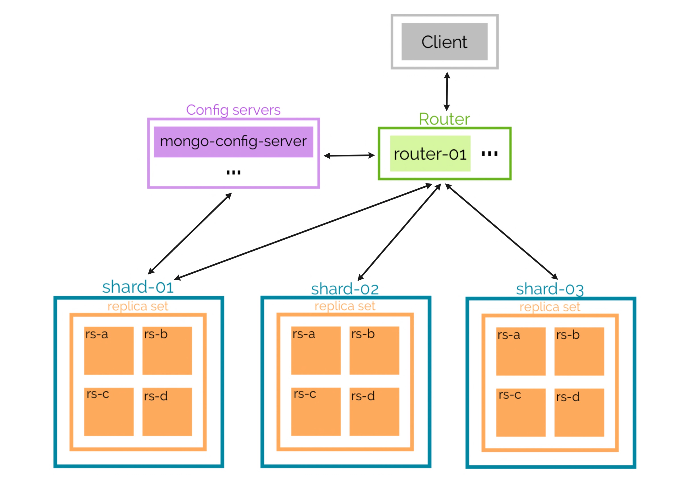

Mongo Sharded Cluster with Docker
=========================================

### Components

* Router (mongos): `router01`
* Config Server (mongod): `mongo-config-server`
* 3 Shards:
	* `shard-01-rs-a`,`shard-01-rs-b`, `shard-01-rs-c`, `shard-01-rs-d`
	* `shard-02-rs-a`,`shard-02-rs-b`, `shard-02-rs-c`, `shard-02-rs-d`
	* `shard-03-rs-a`,`shard-03-rs-b`, `shard-03-rs-c`, `shard-03-rs-c`




### Setup
- **Step 1: Start all of the containers**

```bash
docker-compose up -d
```

- **Step 2: Initialize replica sets**

```bash
docker exec mongo-config-server sh -c "mongo < /scripts/init-configserver.js"

docker exec shard-01-rs-a sh -c "mongo < /scripts/init-shard01.js"
docker exec shard-02-rs-a sh -c "mongo < /scripts/init-shard02.js"
docker exec shard-03-rs-a sh -c "mongo < /scripts/init-shard03.js"
```

- **Step 3: Initialize router**

```bash
docker exec router-01 sh -c "mongo < /scripts/init-router.js"
```

- **Step 4: Enable sharding and setup sharding-key**
```bash
docker exec -it router-01 bash
mongo
use database

// Enable sharding for database `database`
sh.enableSharding("database")

// Setup shardingKey for collection `collection`**
db.adminCommand( { shardCollection: "database.collection", key: { type: "hashed" } } )

```

### Verify

- **Verify status of sharded cluster**

```bash
docker exec -it router-01 bash
mongo
use database
sh.status()
```

- **Verify status of replica set for each shard**
> see 1 PRIMARY, 3 SECONDARY

```bash
docker exec -it shard-01-rs-a bash -c "echo 'rs.status()' | mongo --port 27017" 
docker exec -it shard-02-rs-a bash -c "echo 'rs.status()' | mongo --port 27017" 
docker exec -it shard-03-rs-a bash -c "echo 'rs.status()' | mongo --port 27017" 
```

- **Check database status**
```bash
docker exec -it router-01 bash
mongo
use database
db.stats()
db.collection.getShardDistribution()
```
---
Gruppe Gamma: Beatrice Inschakov, Til Hunke, Sabrina Cielas